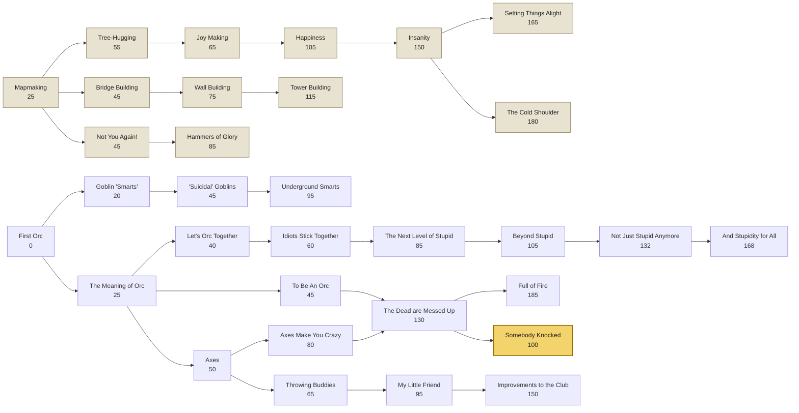
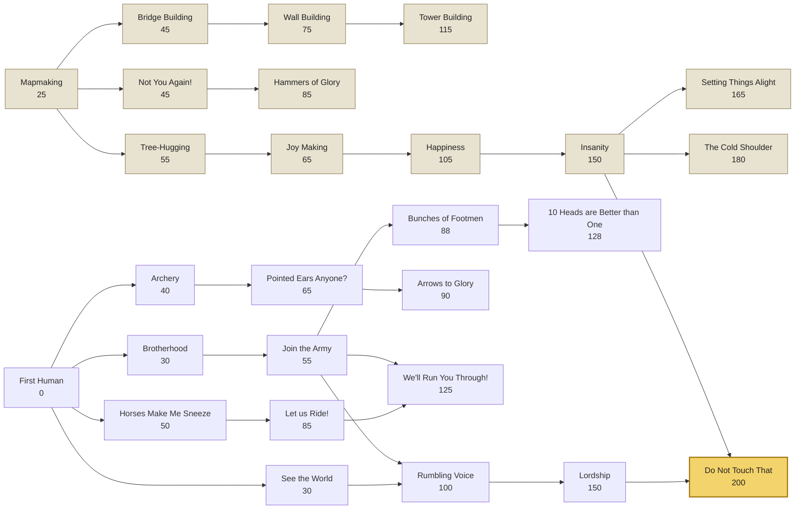

# Tech trees

> Generated from `src/model/techs.ts` by `tools/tech-tree.run.test.ts` -- do not edit by hand.
> Regenerate with `npx vitest run --config vitest.sweep.config.ts tools/tech-tree.run.test.ts`.

Costs are base prices. The real price of an advance is marked up by 3.5% for every advance already known (`techCost` in `src/sim/research.ts`), so the same advance costs more the later it is learned.

- **Horde**: 32 advances -- 12 shared, 20 its own.
- **Kingdom**: 27 advances -- 12 shared, 15 its own.

## The road to each ending

Everything a side must learn to reach its section 110 ending advance, in the order a straight run at it would take, and what that costs from a standing start with the markup applied. The AI does not take a straight run: the last column counts the advances its research list asks for first.

| Side | Ending advance | Advances on the road | Base cost | Straight run, marked up | Asked for first by the AI list | Their base cost |
|---|---|---|---|---|---|---|
| Horde | Somebody Knocked | 7 | 430 | 480 | 18 not on the road | 1297 |
| Kingdom | Do Not Touch That | 12 | 965 | 1199 | 12 not on the road | 921 |

**Horde:** First Orc (0) → The Meaning of Orc (25) → To Be An Orc (45) → Axes (50) → Axes Make You Crazy (80) → The Dead are Messed Up (130) → Somebody Knocked (100)

**Kingdom:** First Human (0) → Mapmaking (25) → See the World (30) → Brotherhood (30) → Tree-Hugging (55) → Join the Army (55) → Joy Making (65) → Rumbling Voice (100) → Happiness (105) → Lordship (150) → Insanity (150) → Do Not Touch That (200)

## The Horde's tree

Shared advances are pale; the ending advance is gold.

## The Kingdom's tree

Shared advances are pale; the ending advance is gold.

## Shared advances

| Advance | Cost | Needs | Units | Structures | Effect | Depth | Flavour |
|---|---|---|---|---|---|---|---|
| **Mapmaking** `mapmaking` | 25 | -- | -- | -- | mapmaking | 0 | The world turns out to have a shape. Everyone is a little put out about it. |
| **Bridge Building** `bridge-building` | 45 | Mapmaking | -- | Attempted Outpost, Forward Depot | bridges | 1 | Walking around the swamp was, in hindsight, a choice. |
| **Not You Again!** `not-you-again` | 45 | Mapmaking | -- | Goblin Treasury, Simple Market | -- | 1 | The same coin keeps turning up. Eventually somebody scratches a number on it and the whole economy follows. |
| **Tree-Hugging** `tree-hugging` | 55 | Mapmaking | -- | Granary | -- | 1 | If you do not eat the whole forest immediately, there is more forest later. |
| **Joy Making** `joy-making` | 65 | Tree-Hugging | -- | Totem of Managed Feelings, Chapel of Mild Optimism | -- | 2 | Morale is discovered, immediately weaponised, and then regulated. |
| **Wall Building** `wall-building` | 75 | Bridge Building | -- | Walls, Broken Catapult | -- | 2 | A bridge, but standing up and unwelcoming. The Horde attends the same lecture and comes away with a catapult. |
| **Hammers of Glory** `hammers-of-glory` | 85 | Not You Again! | -- | The Thinking Rock, Hall of Careful Notes | -- | 2 | It emerges you can build a place specifically for thinking in. The hammers were, in the end, the easy part. |
| **Happiness** `happiness` | 105 | Joy Making | -- | -- | contentment | 3 | Formal proof that people who are not miserable work slightly harder. |
| **Tower Building** `tower-building` | 115 | Wall Building | -- | Goblin Vault, Reinforced, Slightly Complicated Market | watchtower | 3 | A wall, but taller and lonelier. |
| **Insanity** `insanity` | 150 | Happiness | -- | Considerably Larger Totem, Cathedral of Firm Conviction | berserk | 4 | Happiness, taken one step further than anyone recommended. |
| **Setting Things Alight** `pyromancy` | 165 | Insanity | -- | -- | pyromancy | 5 | Fire was always available. What is new is doing it to somebody deliberately, from a distance, and then walking away while it continues. |
| **The Cold Shoulder** `cryomancy` | 180 | Insanity | -- | -- | cryomancy | 5 | Nobody has worked out how to make a thing colder. They have worked out how to make a thing very slow, which for military purposes is the same discovery. |

## Horde advances

| Advance | Cost | Needs | Units | Structures | Effect | Depth | Flavour |
|---|---|---|---|---|---|---|---|
| **First Orc** `first-orc` | 0 | -- | Peon, Goblin | -- | -- | 0 | There is an orc. This took considerably longer than you would expect. |
| **Goblin "Smarts"** `goblin-smarts` | 20 | First Orc | Two Goblins, Three Goblins | -- | -- | 1 | The goblins work it out first. Nobody enjoys this. |
| **The Meaning of Orc** `orc-meaning` | 25 | First Orc | Orc | -- | -- | 1 | A long night of reflection concludes that an orc is a thing that hits. |
| **Let's Orc Together** `orc-together` | 40 | The Meaning of Orc | Two Orcs | -- | -- | 2 | Two orcs can stand in the same place. Nothing is ever the same again. |
| **"Suicidal" Goblins** `suicidal-goblins` | 45 | Goblin "Smarts" | Five Goblins, Goblin Sapper | -- | -- | 2 | The quotation marks are load-bearing. Nobody has explained them. |
| **To Be An Orc** `to-be-an-orc` | 45 | The Meaning of Orc | -- | Barracks, Orc Posting | -- | 2 | It emerges that an orc can be trained, which is to say shouted at on purpose. |
| **Axes** `axes` | 50 | The Meaning of Orc | Troll | -- | -- | 2 | Sharpened on one side. The Horde considers this its finest hour so far. |
| **Idiots Stick Together** `idiots-stick-together` | 60 | Let's Orc Together | Three Orcs | -- | -- | 3 | Three. The number is three. It comes after the other two. |
| **Throwing Buddies** `throwing-buddies` | 65 | Axes | Axethrower, Two Axethrowers | -- | -- | 3 | The axe goes away from you. This is the entire discovery. |
| **Axes Make You Crazy** `axes-crazy` | 80 | Axes | Two Trolls, Three Trolls | -- | swampy | 3 | Correlation is established. Causation is declared uninteresting. |
| **Underground Smarts** `underground-smarts` | 95 | "Suicidal" Goblins | Two Goblin Sappers, Goblin Catapult | The Considerably Bigger Rock | volatile | 3 | Everything is better underground, where nobody can see how it is going. |
| **The Next Level of Stupid** `next-level-stupid` | 85 | Idiots Stick Together | Four Orcs | -- | -- | 4 | Four orcs. The Horde is officially past what its hands can represent. |
| **My Little Friend** `my-little-friend` | 95 | Throwing Buddies | Three Axethrowers, Ogre | -- | -- | 4 | Every orc should have someone larger standing behind them. |
| **The Dead are Messed Up** `dead-messed-up` | 130 | To Be An Orc, Axes Make You Crazy | Death Knight | -- | bargain | 4 | A finding delivered with unusual confidence and no supporting evidence. |
| **Somebody Knocked** `somebody-knocked` | 100 | The Dead are Messed Up | -- | The Knocking Stones, The Pit of Offerings, The Demonic Portal | ending | 5 | Something under the ground knocked. An orc knocked back. Neither of them has been able to stop since. |
| **Beyond Stupid** `beyond-stupid` | 105 | The Next Level of Stupid | Six Orcs | -- | -- | 5 | Six orcs, achieved by doing three orcs twice and refusing to elaborate. |
| **Improvements to the Club** `club-improvement` | 150 | My Little Friend | -- | -- | clubs | 5 | Three of them, and no agreement on which is best. The argument is ongoing and occasionally on fire. |
| **Full of Fire** `full-of-fire` | 185 | The Dead are Messed Up | Two Death Knights, Dragon | -- | -- | 5 | The Horde has one plan for the late game and has now finished writing it down. |
| **Not Just Stupid Anymore** `not-just-stupid` | 132 | Beyond Stupid | Eight Orcs | -- | coordination | 6 | Eight orcs, all walking the same way. Historians will not believe this part. |
| **And Stupidity for All** `stupidity-for-all` | 168 | Not Just Stupid Anymore | Ten Orcs | The Yelling Grounds | -- | 7 | Ten orcs. One unit. One extremely large mistake waiting to happen. |

## Kingdom advances

| Advance | Cost | Needs | Units | Structures | Effect | Depth | Flavour |
|---|---|---|---|---|---|---|---|
| **First Human** `first-human` | 0 | -- | Peasant, Footman | -- | -- | 0 | A human, with a name, a trade, and three opinions about the tax code. |
| **Brotherhood** `brotherhood` | 30 | First Human | Two Footmen | -- | -- | 1 | A man may stand beside another man. The paperwork runs to forty pages. |
| **See the World** `see-the-world` | 30 | First Human | Outrider | -- | -- | 1 | Someone should go and look. Someone else should write down what they saw. |
| **Archery** `archery` | 40 | First Human | Archer | -- | -- | 1 | Like Throwing Buddies, except you get to keep the pointy thing. |
| **Horses Make Me Sneeze** `horses-sneeze` | 50 | First Human | Knight | -- | -- | 1 | The Kingdom presses on regardless, eyes streaming, into the age of cavalry. |
| **Join the Army** `join-army` | 55 | Brotherhood | Three Footmen | Barracks, Soldier Posting | -- | 2 | See the world. Meet interesting people. Stand extremely close to them. |
| **Pointed Ears Anyone?** `pointed-ears` | 65 | Archery | Two Archers | -- | -- | 2 | An enquiry is opened into who exactly has been helping with the archery. |
| **Let us Ride!** `let-us-ride` | 85 | Horses Make Me Sneeze | Two Knights | -- | -- | 2 | Two knights, riding abreast, at considerable expense to everyone. |
| **Bunches of Footmen** `bunches-footmen` | 88 | Join the Army | Five Footmen | -- | -- | 3 | The official term is "bunches". The Royal Academy fought this and lost. |
| **Arrows to Glory** `arrows-glory` | 90 | Pointed Ears Anyone? | Three Archers, Ballista | -- | -- | 3 | If one arrow is glory, the correct number of arrows is all of them. |
| **Rumbling Voice** `rumbling-voice` | 100 | See the World, Join the Army | Mage | -- | -- | 3 | It is discovered that saying things in a deeper voice makes them true. |
| **We'll Run You Through!** `run-you-through` | 125 | Let us Ride!, Join the Army | Three Knights, Paladin | -- | valour | 3 | Shouted in advance, as courtesy demands. |
| **10 Heads are Better than One** `ten-heads` | 128 | Bunches of Footmen | Ten Footmen | Hall of Cross-Referenced Notes | coordination | 4 | Ten heads, one direction, and a rota for who carries the flag. |
| **Lordship** `lordship` | 150 | Rumbling Voice | Two Mages, Two Paladins | The Parade Ground | -- | 4 | The rumbling voice is given a hat, a title, and a great deal of land. |
| **Do Not Touch That** `do-not-touch` | 200 | Lordship, Insanity | -- | The Committee Chamber, A Very Good Pedestal, The Mysterious Object | ending | 5 | A committee has been formed to establish what it does. So far it has agreed on the wording of the sign. |

## Dead ends

Advances nothing else depends on.

- **Shared:** Tower Building, Hammers of Glory, Setting Things Alight, The Cold Shoulder
- **Horde:** Underground Smarts, And Stupidity for All, Improvements to the Club, Full of Fire, Somebody Knocked
- **Kingdom:** 10 Heads are Better than One, Arrows to Glory, We'll Run You Through!, Do Not Touch That

## What the AI researches first

Each personality works down its `techPriority` list (`src/ai/ai.ts`), taking the first advance it can research, and falls back to the cheapest available once the list is exhausted. Advances on the road to its ending are marked.

**Horde**

1. Mapmaking (25)
2. Bridge Building (45)
3. Goblin "Smarts" (20)
4. The Meaning of Orc (25) — *on the road to its ending*
5. Let's Orc Together (40)
6. Not You Again! (45)
7. To Be An Orc (45) — *on the road to its ending*
8. "Suicidal" Goblins (45)
9. Axes (50) — *on the road to its ending*
10. Tree-Hugging (55)
11. Idiots Stick Together (60)
12. Joy Making (65)
13. Hammers of Glory (85)
14. Throwing Buddies (65)
15. Wall Building (75)
16. The Next Level of Stupid (85)
17. Happiness (105)
18. Axes Make You Crazy (80) — *on the road to its ending*
19. Beyond Stupid (105)
20. My Little Friend (95)
21. Improvements to the Club (150)
22. Not Just Stupid Anymore (132)
23. The Dead are Messed Up (130) — *on the road to its ending*
24. Somebody Knocked (100) — *on the road to its ending*
25. And Stupidity for All (168)
26. Full of Fire (185)

**Kingdom**

1. Mapmaking (25) — *on the road to its ending*
2. Bridge Building (45)
3. Brotherhood (30) — *on the road to its ending*
4. Archery (40)
5. Not You Again! (45)
6. Join the Army (55) — *on the road to its ending*
7. Tree-Hugging (55) — *on the road to its ending*
8. Horses Make Me Sneeze (50)
9. Joy Making (65) — *on the road to its ending*
10. Hammers of Glory (85)
11. Bunches of Footmen (88)
12. Wall Building (75)
13. Happiness (105) — *on the road to its ending*
14. Pointed Ears Anyone? (65)
15. 10 Heads are Better than One (128)
16. Let us Ride! (85)
17. Arrows to Glory (90)
18. We'll Run You Through! (125)
19. Rumbling Voice (100) — *on the road to its ending*
20. Lordship (150) — *on the road to its ending*
21. Insanity (150) — *on the road to its ending*
22. Do Not Touch That (200) — *on the road to its ending*
